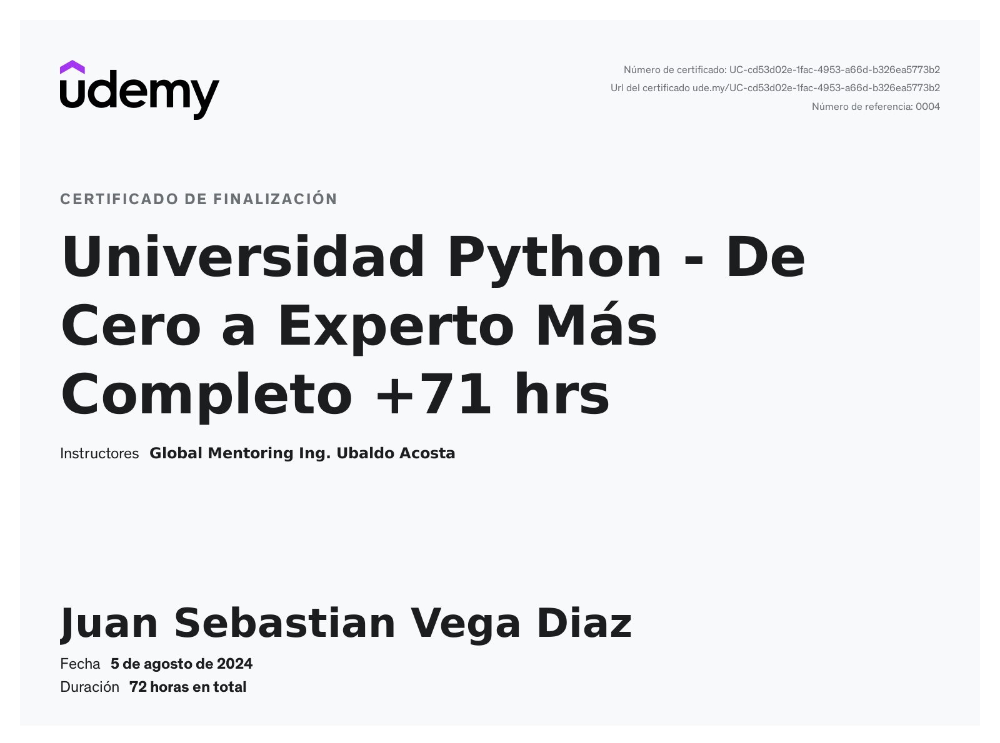

# Universidad Python de Cero a Experto  +84 hrs 
## Mi Camino en la Universidad Python de Cero a Experto

Este repositorio contiene los ejercicios que he realizado mientras completaba el curso "Universidad Python de Cero a Experto" en Udemy. Después de más de 84 horas de contenido, he logrado profundizar en los aspectos fundamentales y avanzados de Python, desde la programación básica hasta el desarrollo de aplicaciones web y de escritorio. 

**[Certificado de culminación](Certificado/UC-cd53d02e-1fac-4953-a66d-b326ea5773b2.jpg)**

Este repositorio contiene los ejercicios que he realizado mientras completaba el curso "Universidad Python de Cero a Experto" en Udemy. Después de más de 84 horas de contenido, he logrado profundizar en los aspectos fundamentales y avanzados de Python, desde la programación básica hasta el desarrollo de aplicaciones web y de escritorio.

## ¿Qué aprendí?

Durante este curso, abordé una amplia variedad de temas que me permitieron desarrollar una comprensión sólida de Python:

### Fundamentos de Python

- Comencé desde lo básico, aprendiendo a manejar variables, operadores, y estructuras de control como If-Else y ciclos.
- Profundicé en colecciones como listas, tuplas, sets y diccionarios, y me familiaricé con la creación y uso de funciones.

### Programación Orientada a Objetos (POO)

- Exploré los conceptos de clases y objetos, encapsulamiento, herencia y polimorfismo.
- Aprendí a manejar excepciones, trabajar con archivos, y diseñar clases utilizando los principios de la POO.

### Conexión a Bases de Datos

- Configuré y conecté Python con bases de datos Postgresql.
- Realicé operaciones CRUD y aprendí a manejar transacciones y logging para administrar mejor mis aplicaciones.

### Interfaces Gráficas (GUI)

- Creé aplicaciones de escritorio utilizando Tkinter y PySide (Qt), diseñando interfaces gráficas completas y manejando eventos y layouts.

### Desarrollo Web

- Aprendí a desarrollar aplicaciones web con Django y Flask, implementando modelos, vistas, templates, y utilizando ORMs para manejar bases de datos.

## Mi Certificado

Después de todo este esfuerzo, estoy orgulloso de haber culminado el curso y obtenido mi certificado. Aquí está la imagen de mi certificado:

¡Gracias por visitar mi repositorio!
